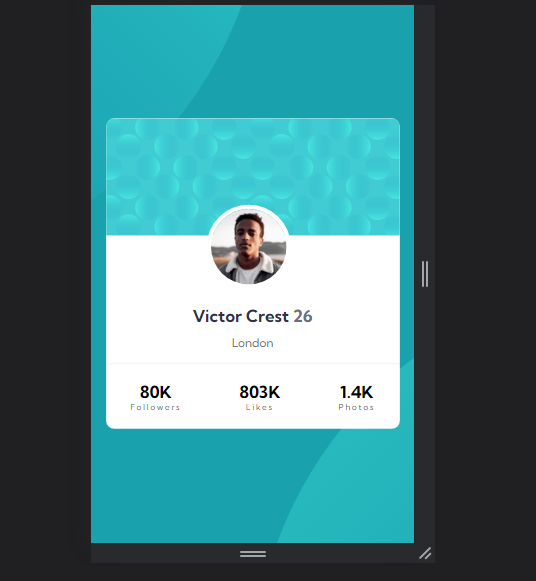

# Frontend Mentor - Profile card component solution

 Frontend Mentor challenges help you improve your coding skills by building realistic projects. 

## Table of contents

- [Overview](#overview)
  - [The challenge](#the-challenge)
  - [Screenshot](#screenshot)
  - [Links](#links)
  - [Built with](#built-with)
  - [What I learned](#what-i-learned)
## Overview
This is a solution to the [Profile card component challenge on Frontend Mentor](https://www.frontendmentor.io/challenges/profile-card-component-cfArpWshJ).

### The challenge

- Build out the project to the designs provided

### Screenshot

### Links

- Solution URL: [ solution URL ](https://www.frontendmentor.io/solutions/profilecardcomponent-RhFcwdZLk_)
- Live Site URL: [ live site URL ]( https://iceberg61.github.io/Profile-card-component/)

### Built with

- Semantic HTML5 markup
- CSS custom properties
- Flexbox

### What I learned
i learnt how to use pseudo classes.
the before and after pseudo classes.

## Author

- Frontend Mentor - [@iceberg61](https://www.frontendmentor.io/profile/iceberg61)
- Twitter - [@ayanakoji-kiyo](https://www.twitter.com/ayanakoji-kiyo)
